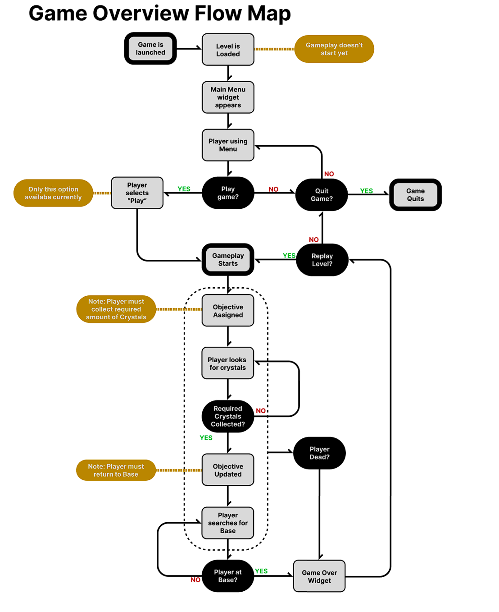
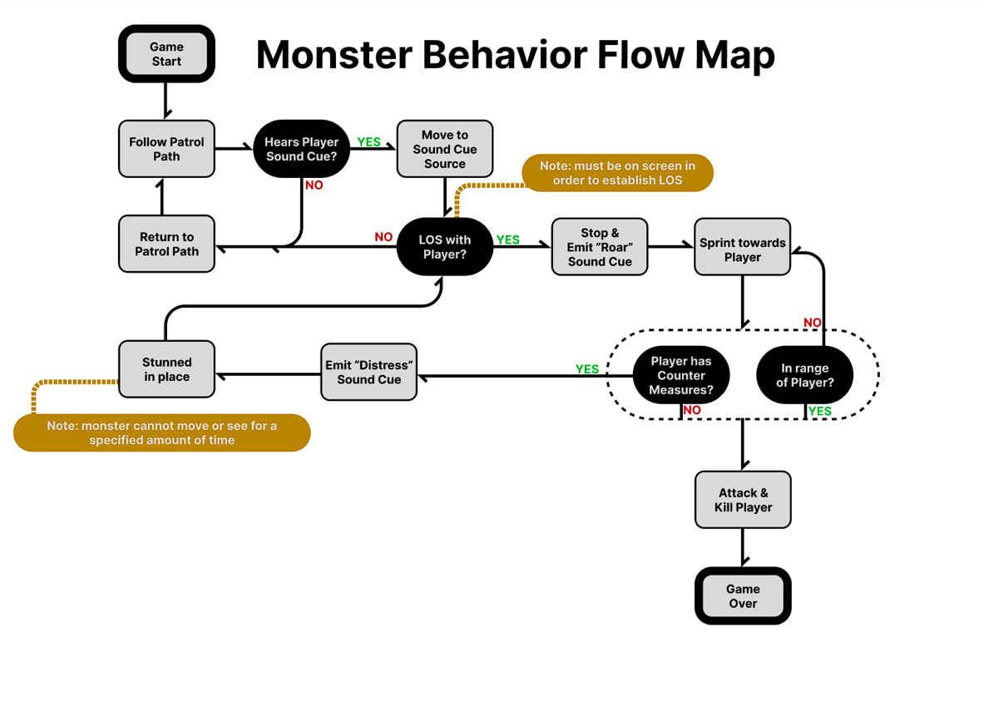

# Stellar Harvest

Stellar Harvest is a collaborative project born to compete in the "Autumn Harvest Challenge" proposed by CG Spectrum.  

Here's a video showing the final complete game with all the features implemented.

[Showcase Video](https://www.youtube.com/watch?v=-4n2DoCYoSM)

## The challenge
The goal of the challenge is to create a single playable level that follows this theme: **Harvesting**.

Time limit: 8 weeks.

Start date: 26 september 2023

Deadline: 21 november 2023

Status: **delivered**

We have been given a couple of rules:
* Modeling side, only 10 objects can be created;
* Design side, we should define at least 3 interactions;
* Must be SFW;
* We are able to use the stuff packed in the Unreal Starter Content;
* We are able to use free plugins, sounds, particles and animations;

## The Team - Gourd Ghouls

Designers:
* [Connor Dearborn](https://sites.google.com/view/conrdesign?usp=sharing)
* @Sean Kannemeyer

Modelers:
* @Miranda Robinson
* @Kishen Patel

Programmer:
* Me :)

## The concept
**Theme**: Harvest, Science-Fiction.

**Genre**: Top-Down Isometric Adventure

**Player Objective**: Harvest required crystals and come back to the base as quickly as possible avoiding monsters roaming around the level.
Best Time gets saved and shown to the player.

**Gameplay flow synopsis:**
The Gourd Ghouls Inc. is happy to announce the end of production of the Space Tractor 2001. You will be finally able to completely **eradicate** all the crystals of this new Moon! But be careful of Monsters... they're not so friendly with greedy humans.

Here some of the **fanciest** features of our new Tractor:
* **Counter Measure** (CM): gadget equipped by the space tractor, it **generates** a circle of high force around the tractor that **stun** every monster who touches it;
* **Floating rocks**: the space tractor is equipped with an anti-gravitational gadget that allows the tractor to **shoot** floating rocks towards monsters to **stun** them;
* **Boost**: the space tractor can instantly **increase** its **velocity** to evade monsters;
* **Cloak**: the space tractor can **harness** light to become **invisible** to monsters and evade them;

**BE CAUTIOUS:** Boost and Cloak consume a lot of power, so they need time to be recharged. 

The Gourd Ghouls Inc. is not responsible for humans getting eaten.

### Game Flow

### Monsters Flow

## Features highlight

### Abilities

"**Boost**" and "**Cloak**" are abilities. Since we planned to give just two abilities to the player I implemented a component 
called "**AbilityComponent**" which handles just two abilities, called **Primary Ability** and **Secondary Ability**. Those are tunable from Blueprint.
The idea is that every ability should implement the IAbility interface which expose two functions:
* `Apply`
* `Remove`

Those functions are marked as `BlueprintNativeEvent` to give designers the possibility to quickly implement and test their own abilities.

I considered "**Boost**" and "**Cloak**" as "**Passive Abilities**" since they just apply an "**Effect**", so they derive from `UEffectAbility`.
This class describes an Ability which has a duration and a cooldown. After its duration it gets removed and it cannot be used again until cooldown is finished.

For simplicity sake, **AbilityComponent** can deal with only `UEffectAbility` but in future it is intended to work with more general IAbility.

To summarize, designers can create new Abilities by deriving from `UEffectAbility` and implementing the Apply and Remove function in the EventGraph.
After that, you just have to tune the new Ability in the AbilityComponent as Primary or Secondary Ability.

In this video I show how Boost and Cloak work and how I replicated the Boost ability using Blueprint.

[Showcase video](https://youtu.be/S6_gVukWXWk)

I created a custom DataTable to store cosmetics info about Abilities to show them in the Player's HUD.

### Interaction system

The interaction system implemented is intended to give designers the possibility to create new interactable objects using blueprints implementing just two events.
The first interactable object created is `ACrystal` which represent a **Crystal Cluster** where a player can harvest crystals. This is entirely implemented in C++.

I created the `IInteractable` interface which defines this public methods:
* `StartInteraction`
* `FinishInteraction`
* `CanBeInteracted`

Designers or programmers can create new interactable objects by deriving from any class, they just have to implement this interface and its functions.

This is the flow of the interactions:
1. The player presses the interact button
2. The pawn checks if it's facing an actor that implements the IInteractable interface
3. If yes, `CanBeInteracted` is called
4. If yes, `StartInteraction` is executed
5. When the interact button is released the `FinishInteraction` is executed

You can create any kind of interactions, both **single-press interactions** and **hold-release interactions**.

You can attach the "**Highlight Component**" to your new interactable object to show a widget on top of it when a pawn can interact with it.

In this video I show how `ACrystal` works and how I implemented the Rock Throwing feature by creating an interactable object using just blueprints.

[Showcase video](https://youtu.be/u3dTCPrgrRw)

### Counter Measure

The Counter Measure is a feature requested to give the player the possibility to stun monsters. 
This is achieved by the "Counter Measure Component" which takes care of mainly two things:
* Check if a monster is in range, so HUD is notified and shows a message to the player;
* Stun every monster in range when requested;

The highlight about this component is that it comes with two different kind of modes:
* Instant
* Gradually

Instant mode instantly stun monsters that are in range (a sphere around the player).

Gradually mode it slowly increases the radius around the player and stun a monster only if it is inside this radius. So timing is crucial.

This is completely tunable by designers. 

In this video I show how it can be easily tuned to quickly test which mode is best.

[Showcase video](https://youtu.be/-PsABYwzmEQ)

### Crystal Collector

The main feature of the game, crystal harvesting, has been implemented in the "**Crystal Collector Component**". 
This component gets activated by pressing the interaction button and if the player is facing an `ACrystal`.

Like the Counter Measure Component, this component comes with two modes:
* **One-shot** harvest
* **Step** harvest

When a player is facing an `ACrystal` he can hold the interaction button to start harvesting the crystals and he stops when he releases the interact button.
The ACrystal actor has a property, **Duration**, which defines how much time you have to harvest it to gain crystals.

If the **Crystal Collector Component** is configured to "**one-shot** harvest" the harvesting starts and the player gets its crystals after the entire **Duration**.

If **Step** harvest is configured, designers can tune how many crystals per step a player can harvest. So when the player starts the harvesting process he gains crystals every x seconds, based on the duration of the harvesting.
So, if the component can gain 2 crystals per step and the player is harvesting a crystal with a duration of 10 seconds, he gets 2 crystals every 2 seconds.
This works for every kind of configuration, also for odd numbers.

In this video I show how these two modes work and how a designer can easily tune it.

[Showcase video](https://youtu.be/jFJLQ_DTHM4)

### Sound design

Monsters can **react** to **sound** cues made by the player. If a monster hears a sound it will stop its patrolling to investigate the source of the sound.
A player produces a sound by harvesting a crystal or simply moving his tractor. Faster the tractor, louder the sound.

In this video I show how this feature can be easily tuned by designers to extend or reduce the range of sounds produced by the player.

[Showcase video](https://youtu.be/cDpsk7C1Ug4)

### Events for cosmetics (Blueprint)

I chose to use blueprints to spawn particle effects, play sounds, play feedback or any other cosmetic/visual effect, since I found them 
easier and more flexible to change, even for designers. 
So I put a lot of events in my custom components to give the possibility to designers to customize even more our features. 
For instance, in the tractor character I used the Counter Measure Component events to spawn particle effects to give visual feedback to the player that something's happening.

In this video I show how some of these events are used and how.

[Showcase video](https://youtu.be/dErdlQUyveA)

### Scaled Mouse Movement

We chose to implement **movement** with **gamepad**, classical **wasd** and using **mouse**.
The idea is that the tractor will follow the mouse cursor when it's moved in the viewport of the game. 
The velocity of the tractor is scaled based on the distance between the mouse cursor and the middle of the screen (the tractor). So farther the mouse cursor, faster is the tractor.

In this video I show how designers can tune some properties in the controller class of the tractor to change the feeling of this feature.
They can also turn it the movement using the mouse or turn off the scaling of the velocity.

[Showcase video](https://youtu.be/YnEVtgjdEZo)

## Credits

Game And Level Design/Painting by [Connor Dearborn](https://sites.google.com/view/conrdesign?usp=sharing) and @Sean Kannemeyer

Modeling and Texturing by @Miranda Robinson and @Kishen Patel

